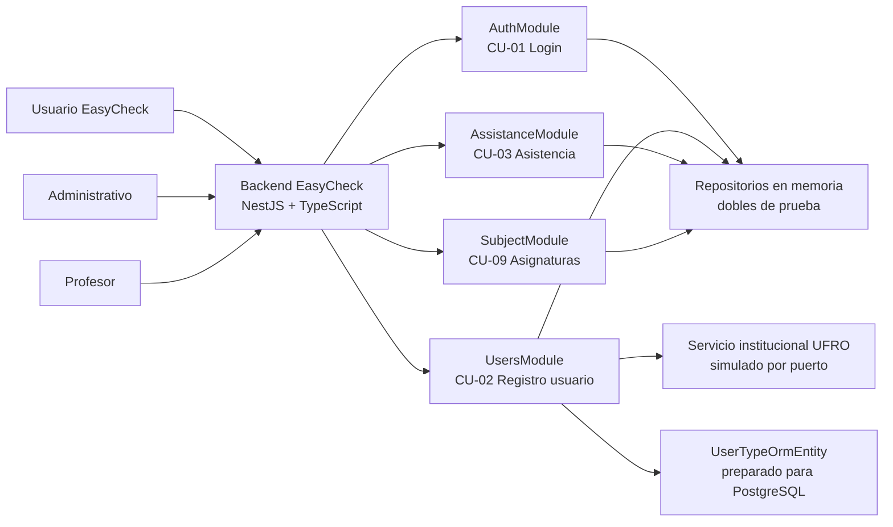

# Avance 2 - Secciones faltantes sugeridas

Este documento contiene texto listo para completar los apartados pendientes del informe "Avance 2" de EasyCheck, redactado en base al codigo implementado en el backend NestJS y a las suites de prueba existentes.

## 1. Arquitectura implementada

La arquitectura del backend de EasyCheck fue implementada sobre NestJS y TypeScript, separando responsabilidades por modulos funcionales asociados a los casos de uso priorizados. El modulo raiz `AppModule` integra los modulos `AuthModule`, `UsersModule`, `AssistanceModule` y `SubjectModule`, los cuales concentran la logica correspondiente a inicio de sesion, registro de usuarios, consulta/registro de asistencia y registro de asignaturas.

La solucion sigue una organizacion por capas. En la capa de entrada se ubican los controladores REST, responsables de exponer los endpoints HTTP y traducir errores de dominio a codigos de estado adecuados. En la capa de aplicacion se ubican los servicios, donde se implementan las reglas de negocio de cada caso de uso. En la capa de persistencia/adaptadores se utilizan repositorios en memoria para pruebas y una entidad TypeORM preparada para representar usuarios en PostgreSQL. En el modulo de usuarios se aplica una aproximacion hexagonal mas explicita, ya que `RegisterUserService` depende de puertos (`UsersRepositoryPort` e `InstitutionalIdentityPort`) y no de implementaciones concretas.

Los casos de uso implementados se mapean de la siguiente forma:

| Caso de uso | Modulo | Endpoint/servicio principal | Estado |
| --- | --- | --- | --- |
| CU-01 Inicio de sesion | `AuthModule` | `POST /api/v1/auth/login`, `AuthService` | Implementado y validado con BDD |
| CU-02 Registro de usuario | `UsersModule` | `POST /api/v1/users/register`, `RegisterUserService` | Implementado y validado con BDD |
| CU-03 Consulta de asistencia | `AssistanceModule` | `GET /api/v1/students/:rut/assistance`, `AssistanceService` | Implementado y validado con TDD e integracion |
| CU-09 Registro de asignatura | `SubjectModule` | `POST /api/v1/subjects`, `SubjectService`, `AdminGuard` | Implementado y validado con TDD |

Diagrama logico tipo C4:



La API tambien incorpora validacion global mediante `ValidationPipe`, configurada en `main.ts` con `whitelist`, `transform` y `forbidNonWhitelisted`. Ademas, se habilita documentacion Swagger en `/api/docs`, lo que permite revisar el contrato HTTP de los endpoints implementados.

## 2.2. TDD

El Desarrollo Guiado por Pruebas se aplico principalmente sobre CU-03 y CU-09. En ambos casos se partio desde pruebas unitarias que expresaban reglas de negocio concretas, luego se implemento el codigo minimo necesario para aprobarlas y finalmente se ajusto la estructura interna para mejorar legibilidad, separacion de responsabilidades y manejo de errores.

### 2.2.1. Primer ciclo - CU-03 Consulta de asistencia por estudiante

**Red.** Se definieron pruebas unitarias para `AssistanceService.getStudentAttendanceByRut`, cubriendo cuatro reglas principales: rechazar un RUT invalido, obtener la asistencia de un estudiante existente, rechazar consultas de estudiantes inexistentes y retornar porcentaje 0 cuando una asignatura no tiene clases registradas. Inicialmente estas pruebas fallaban porque el servicio no contaba con la validacion completa de RUT ni con el calculo de porcentaje de asistencia por asignatura.

**Green.** Se implemento el metodo `getStudentAttendanceByRut` en `AssistanceService`. La solucion valida el formato del RUT, consulta al estudiante mediante `DataRepository`, recupera las asignaturas inscritas y calcula `attendancePercentage` con la formula:

```text
attendancePercentage = round((attendedClasses / totalClasses) * 100)
```

Cuando `totalClasses` es 0, el servicio retorna porcentaje 0 para evitar divisiones invalidas.

**Refactor.** Se encapsulo la validacion de RUT en el metodo privado `isValidRut`, se mantuvo el calculo dentro de una transformacion clara sobre las filas retornadas por el repositorio y se corrigieron hallazgos sugeridos por SonarQube, como el uso de `replaceAll` y la extraccion de ternarios anidados.

Resultado del ciclo: las pruebas TDD de CU-03 quedan aprobadas, validando reglas de negocio y casos borde antes de integrar el flujo con HTTP.

### 2.2.2. Segundo ciclo - CU-09 Registro de asignatura

**Red.** Se escribieron pruebas unitarias para `SubjectService.createSubject` y `AdminGuard`. Las pruebas exigian registrar una asignatura valida, rechazar campos obligatorios vacios, impedir codigos duplicados, rechazar caracteres no permitidos, bloquear solicitudes sin token y bloquear usuarios sin rol administrativo.

**Green.** Se implemento `SubjectService` con tres pasos de validacion: `validateRequiredFields`, `validateFieldFormat` y `assertCodeIsUnique`. Luego se agrego `AdminGuard` para controlar el acceso al endpoint de creacion de asignaturas, retornando `401 Unauthorized` cuando no existe token y `403 Forbidden` cuando el rol no corresponde a `administrador`.

**Refactor.** Se separaron las excepciones de dominio en clases reutilizables (`MissingFieldsException`, `InvalidFieldFormatException`, `SubjectAlreadyExistsException`) y el controlador `SubjectController` quedo encargado de traducir esas excepciones a respuestas HTTP. Con esto, la regla de negocio permanece en el servicio y la capa HTTP mantiene solo responsabilidad de transporte.

Resultado del ciclo: CU-09 queda cubierto por seis pruebas TDD, cuatro asociadas al registro de asignaturas y dos asociadas al control de acceso administrativo.

## 3.3. Comando de ejecucion y resultado resumido

Las pruebas se ejecutaron mediante los scripts definidos en `package.json`:

```bash
npm run test:bdd -- --runInBand
npm run test:tdd -- --runInBand
npm run test:integration -- --runInBand
npm test -- --runInBand
npm run test:e2e -- --runInBand
```

Resultados obtenidos en la ejecucion local:

| Tipo de prueba | Suites | Casos | Resultado |
| --- | ---: | ---: | --- |
| BDD | 2 | 12 | 12 aprobados |
| TDD | 3 | 10 | 10 aprobados |
| Integracion | 1 | 6 | 6 aprobados |
| Unit smoke `AppController` | 1 | 1 | 1 aprobado |
| E2E smoke | 1 | 1 | 1 aprobado |
| Total | 8 | 30 | 30 aprobados |

La ejecucion confirma una tasa de exito del 100%. Los 12 escenarios BDD cubren CU-01 y CU-02, las 10 pruebas TDD cubren CU-03 y CU-09, y las 6 pruebas de integracion validan interacciones reales entre controlador, servicio y repositorio en el modulo de asistencia.

## 4. Pruebas de Integracion

Las pruebas de integracion se aplicaron sobre el modulo de asistencia porque este caso de uso concentra interacciones relevantes entre capa HTTP, servicio de aplicacion y repositorio. La suite `Assistance.integration.spec.ts` utiliza una estrategia bottom-up: primero prepara datos en `DataRepository`, luego levanta una aplicacion NestJS con `AssistanceModule` y finalmente ejecuta solicitudes HTTP reales mediante `supertest`.

Componentes integrados:

| Componente | Responsabilidad validada |
| --- | --- |
| `AssistanceController` | Exponer endpoints REST y traducir excepciones a codigos HTTP |
| `AssistanceService` | Aplicar reglas de negocio de consulta y registro de asistencia |
| `DataRepository` | Simular persistencia de estudiantes, clases, inscripciones, docencias y asistencias |
| `supertest` | Ejecutar llamadas HTTP reales contra la aplicacion NestJS inicializada en memoria |

Flujos cubiertos:

| ID | Flujo | Endpoint | Resultado esperado |
| --- | --- | --- | --- |
| IT-1 | Consultar asistencia de estudiante existente | `GET /api/v1/students/:rut/assistance?subject=ASG-01` | `200 OK`, 10 registros y 100% asistencia |
| IT-2 | Consultar asistencia de estudiante inexistente | `GET /api/v1/students/:rut/assistance?subject=ASG-01` | `404 Not Found` |
| IT-3 | Registrar asistencia mediante QR valido | `POST /api/v1/assistance/register` | `201 Created` e insercion del registro |
| IT-4 | Registrar asistencia con clase deshabilitada | `POST /api/v1/assistance/register` | `409 Conflict` y sin insercion |
| IT-5 | Consultar asistencia de estudiantes por asignatura | `GET /api/v1/professors/:rut/subjects/:code/assistance` | `200 OK`, listado de estudiantes y porcentajes |
| IT-6 | Profesor sin asignatura asociada | `GET /api/v1/professors/:rut/subjects/:code/assistance` | `404 Not Found` |

Estas pruebas son relevantes porque no verifican metodos aislados, sino el flujo completo entre endpoint, servicio y repositorio. Ademas, validan efectos secundarios sobre los datos en memoria, por ejemplo que el registro de asistencia se inserte cuando el QR es valido y que no se inserte cuando la clase tiene registro deshabilitado.

Resultado de ejecucion:

```text
Test Suites: 1 passed, 1 total
Tests:       6 passed, 6 total
```

## 6. Mejoras y deuda tecnica

Las mejoras se priorizan considerando impacto en seguridad, mantenibilidad y cercania con una version productiva del backend.

| Prioridad | Mejora/deuda | Justificacion | Accion planificada para Avance 03 |
| --- | --- | --- | --- |
| Alta | Eliminar credencial institucional hardcodeada | Existe una clave de prueba en `InMemoryInstitutionalIdentityService`. Aunque corresponde a un doble de desarrollo, SonarQube la reporta como vulnerabilidad. | Mover la credencial a variables de entorno y documentar `.env.example`. |
| Alta | Reemplazar repositorios en memoria por persistencia real | Los repositorios actuales permiten pruebas deterministas, pero no representan persistencia productiva. | Implementar repositorios TypeORM para usuarios, asignaturas y asistencia sobre PostgreSQL. |
| Alta | Fortalecer autenticacion/autorizacion | `AdminGuard` valida token/rol de forma simplificada y no existe validacion JWT real. | Incorporar JWT o estrategia equivalente, guard global y decoradores de roles. |
| Media | Corregir textos con problemas de codificacion | Algunos mensajes/comentarios aparecen con caracteres corruptos, lo que afecta legibilidad y calidad del informe/codigo. | Normalizar archivos a UTF-8 y revisar mensajes visibles para usuario. |
| Media | Ampliar pruebas de integracion a CU-01, CU-02 y CU-09 | La integracion mas fuerte esta concentrada en asistencia. | Agregar suites HTTP para login, registro de usuarios y registro de asignaturas. |
| Media | Mejorar validacion DTO en todos los endpoints | Existen DTOs con validacion parcial; algunas reglas se validan manualmente en servicios. | Agregar `class-validator` de forma consistente y documentar respuestas en Swagger. |
| Baja | Refinar estructura de errores | Hay excepciones en ingles y espanol, y algunas respuestas usan `message` mientras otras usan `error`. | Estandarizar formato de error y mensajes por dominio. |
| Baja | Aumentar trazabilidad entre CU, tests y endpoints | El codigo ya tiene buena separacion, pero la trazabilidad puede ser mas visible. | Agregar matriz CU-endpoint-test en documentacion del repositorio. |

Para el siguiente avance, el foco principal sera convertir los dobles en memoria en adaptadores persistentes reales, endurecer seguridad y ampliar integracion. Con esto, el backend pasara desde una version funcional validada academicamente hacia una base mas cercana a produccion.

## 7. Conclusiones

El Avance 2 de EasyCheck permitio consolidar una primera version funcional del backend, implementando los casos de uso priorizados CU-01, CU-02, CU-03 y CU-09. La arquitectura modular en NestJS facilita separar responsabilidades por dominio, mientras que el uso de servicios, repositorios y excepciones especificas permite mantener reglas de negocio verificables y relativamente independientes del transporte HTTP.

La aplicacion de BDD en CU-01 y CU-02 permitio expresar los comportamientos esperados desde el punto de vista del usuario y transformar esos escenarios en pruebas ejecutables. A su vez, la aplicacion de TDD en CU-03 y CU-09 ayudo a definir primero las reglas criticas de negocio y luego implementar el codigo necesario para cumplirlas. Esta combinacion entrega evidencia de que el desarrollo no se limito a escribir codigo funcional, sino que siguio una estrategia verificable desde requerimientos, pruebas y resultados.

Los resultados de ejecucion fueron positivos: 8 suites aprobadas, 30 pruebas exitosas y una cobertura global reportada por SonarQube de 76,4%. Adicionalmente, las pruebas de integracion validaron flujos completos del modulo de asistencia, incluyendo consultas HTTP, reglas de negocio y cambios en el repositorio.

Como deuda tecnica principal queda fortalecer la seguridad, reemplazar credenciales de prueba, persistir datos en PostgreSQL mediante TypeORM y ampliar la cobertura de integracion a los demas casos de uso. Aun asi, el avance cumple con el objetivo de implementar y validar al menos el 40% de los casos de uso prioritarios, dejando una base estable para el Avance 03.

## Referencias

- NestJS Documentation. Controllers, Providers, Modules, Pipes and Testing. https://docs.nestjs.com/
- Jest Documentation. Testing framework and assertions. https://jestjs.io/docs/getting-started
- jest-cucumber. BDD testing with Gherkin for Jest. https://github.com/bencompton/jest-cucumber
- SuperTest. HTTP assertions for Node.js. https://github.com/ladjs/supertest
- SonarQube Documentation. Metrics, coverage, reliability, security and maintainability ratings. https://docs.sonarsource.com/sonarqube-server/
- TypeORM Documentation. Entities and repositories. https://typeorm.io/
- Swagger/OpenAPI. API documentation standard. https://swagger.io/specification/

## Anexos

Se recomienda completar los anexos con los siguientes enlaces y evidencias:

| Anexo | Contenido sugerido |
| --- | --- |
| A1 | Link al repositorio GitHub con codigo fuente, tests, features Gherkin y glue code |
| A2 | Captura de `npm run test:bdd -- --runInBand` con 12 escenarios aprobados |
| A3 | Captura de `npm run test:tdd -- --runInBand` con 10 pruebas aprobadas |
| A4 | Captura de `npm run test:integration -- --runInBand` con 6 pruebas aprobadas |
| A5 | Captura de `npm test -- --runInBand` y `npm run test:e2e -- --runInBand`, completando 30 pruebas totales |
| A6 | Link o captura del dashboard SonarQube con cobertura 76,4%, duplicacion 0,0% y ratings reportados |
| A7 | Evidencias antes/despues de correcciones SonarQube: `replaceAll` y ternario extraido en `Assistance.service.ts` |
| A8 | Video de hasta 5 minutos mostrando ejecucion de pruebas y revision del dashboard SonarQube |

